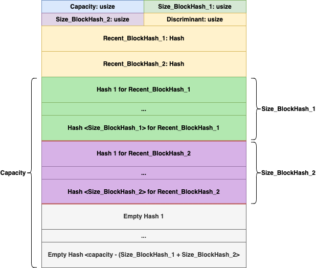
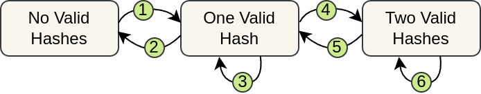
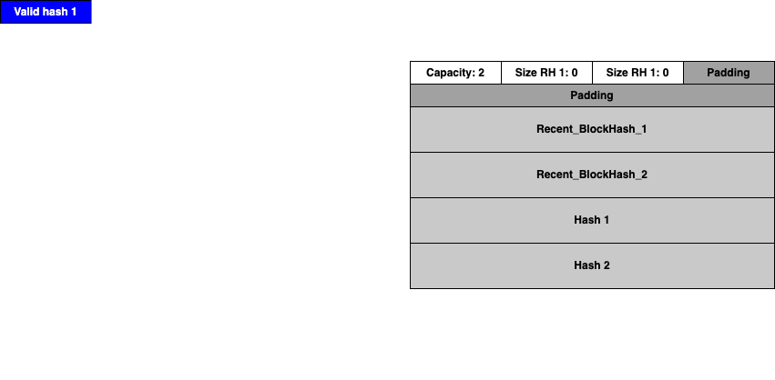

# How the HashStorage struct works

## Background

When the Compto Program validates proofs for the purpose of awarding comptokens, we require that the submitted proof be recently mined (approximately within the past calendar day).
Compto's feedback mechanism relies on an accurate reading of the computational resources invested in a given day to determine the economic status of the currency.
To accomplish this goal, the Compto Program queries the solana blockchain to retreive a recent blockhash. This blockhash serves as a source of pseudorandomness.
The Compto Program uses the recent blockhash for the purposes of both verifying and organizing proofs in the PDA that the Compto Program maintains for the user.
So that there is never a concern from miners about wasted resources, there is builtin overlap for a small amount of time between the last day's mining and the next day's mining.
This document descibes the memory layout and storage strategies for maintaining the recent historical proofs that a user has submitted. 

## Definitions

- **recent_hash:** The blockhash source of pseudorandomness which is generated by Solana and must be included in a valid proof.
- **proof:** The SHA-256 proof that the miner has submitted, which is generated using their public address, the recent_hash, and a nonce.
- **recent_hash_1:** The primary valid blockhash throughout a given day, recent_hash proofs using `recent_hash_1` gradually grow `size_hash_1` and expand the associated region of memory.
- **recent_hash_2:** The second valid blockhash during an overlap period, which only becomes populated if a valid proof using the newest recent_hash is submitted during the overlap period.

## Description

The purpose of this structure is to allow miners a small overlap of time,
where they can either submit a proof with the old recent_hash or a hash with the new recent_hash, and both are considered valid.
This is to prevent miners from doing useless work or having to spin down briefly once per day as the recent_hash changes.

### Rules for Insertion

The provided proof is checked for validity

If there is only one valid recent_hash, it is stored in `recent_hash_1`.

check if provided recent_hash is valid

If `recent_hash_1` is no longer a valid recent_hash
 1. copy all the hashes in the second region to the first region

If the provided hash matches `recent_hash_2`, 
 1. the hash is stored in the second region, at the end of size, increment size

reallocate if capacity < size_blockhash_1 + size_blockhash_2

If the provided hash matches `recent_hash_1`, then
 1. the first hash in the second region is moved to the end of the second region, the size of the second region does not increment
 2. the hash is stored in the first region, at the end of size, increment size


If the provided hash does not match `recent_hash_1` or `recent_hash_2`, then this triggers the 1 hash -> 2 hashes transition
 1. `recent_hash_1` is moved to overwrite `recent_hash_2`
 2. `size_hash_1` is moved to overwrite `size_hash_2`
 3. the provided recent_hash is stored in `recent_hash_1`
 4. `size_hash_1` is set to 0
 5. from here do the same as if the provided hash matches `recent_hash_1`hash

## Memory Layout

  
[ASCII version](#ascii-memory-layout) if the image doesn't work  

## State Machine View

The HashStorage struct can be viewed as a kind of state machine, where the states correspond
to the number of valid recent_hashes, and transitions correspond to legal switches between them.
Possible Events are the states before and after an insert call and correspond to the state
transition(s) they cause.

### Possible States:  
- No valid stored recent_hashes
- One valid stored recent_hash
- Two valid stored recent_hashes


### State Transitions for Stored `recent_hash`es:  
 1. No recent_hashes -> One recent_hash  
 2. One recent_hashes -> No recent_hashes  
 3. One recent_hash -> One recent_hash  
 4. One recent_hash -> Two recent_hashes 
 5. Two recent_hashes -> One recent_hash  
 6. Two recent_hashes -> Two recent_hashes

### State Transitions Diagram

  
[ASCII version](#ascii-state-transitions-diagram) if the image doesn't work  

### Scenarios:
| Possible Events                                                    | State Transitions |
|--------------------------------------------------------------------|-------------------|
| 1. No recent_hashes -> One recent_hash                             | (1)               |
| 2. One recent_hash -> Same recent_hash                             | (3)               |
| 3. One recent_hash -> Two recent_hashes                            | (4)               |
| 4. One recent_hash -> New recent_hash                              | (2), (1)          |
| 5. Two recent_hashes -> Same two recent_hashes                     | (6)               |
| 6. Two recent_hashes -> Only the less old recent_hash is valid     | (5)               |
| 7. Two recent_hashes -> The less old recent_hash + new recent_hash | (5), (4)          |
| 8. Two recent_hashes -> New recent_hash                            | (5), (2), (1)     |

## Scenarios Animation

TODO: vvv Add titles and arrows vvv

  

## ASCII ART

### ASCII Memory Layout

```
HashStorageState
                                  +----------------+----------------+
                                  |   Discriminant: usize           |
+----------------+----------------+----------------+----------------+
|                                                                   |
+                        recent_hash_1: Hash                        +
|                                                                   |
+----------------+----------------+----------------+----------------+
|                                                                   |
+                        recent_hash_2: Hash                        +
|                                                                   |
+----------------+----------------+----------------+----------------+


HashStorage
+----------------+----------------+----------------+----------------+
|         capacity: usize         |         size_hash_1: usize      |
+----------------+----------------+----------------+----------------+
|         size_hash_2: usize      |                                 |
+----------------+----------------+                                 +
|                                                                   |
+                                                                   +
|                                                                   |
+                recent_blockhashes: HashStorageState               +
|                                                                   |
+                                                                   +
|                                                                   |
+----------------+----------------+----------------+----------------+
|                                                                   |
+                           hash_1_1: Hash                          +
|                                                                   |
+----------------+----------------+----------------+----------------+
|                                                                   |
+                                ...                                +
|                                                                   |
+----------------+----------------+----------------+----------------+
|                                                                   |
+                     hash_1_<`size_hash_1`>: Hash                  +
|                                                                   |
+----------------+----------------+----------------+----------------+
|                                                                   |
+                           hash_2_1: Hash                          +
|                                                                   |
+----------------+----------------+----------------+----------------+
|                                                                   |
+                                ...                                +
|                                                                   |
+----------------+----------------+----------------+----------------+
|                                                                   |
+                     hash_2_<`size_hash_2`>: Hash                  +
|                                                                   |
+----------------+----------------+----------------+----------------+
|                                                                   |
+                         empty_hash_1: Hash                        +
|                                                                   |
+----------------+----------------+----------------+----------------+
|                                                                   |
+                                ...                                +
|                                                                   |
+----------------+----------------+----------------+----------------+
|                                                                   |
+    empty_hash_<capacity - (`size_hash_1` `size_hash_2`)>: Hash    +
|                                                                   |
+----------------+----------------+----------------+----------------+
```
[^](#memory-layout)  

### ASCII State Transitions Diagram
```
     +------------------+      +------------------+      +------------------+
     |                  |-(1)->|                  |-(4)->|                  |
     |  No Valid Hashes |      |  One Valid Hash  |      | Two Valid Hashes |
     |                  |<-(2)-|                  |<-(5)-|                  |
     +------------------+      +------------------+      +------------------+
                                      ^     |                    ^     |     
                                      |     |                    |     |     
                                      +-(3)-+                    +-(6)-+     
```
[^](#state-transitions-diagram)  